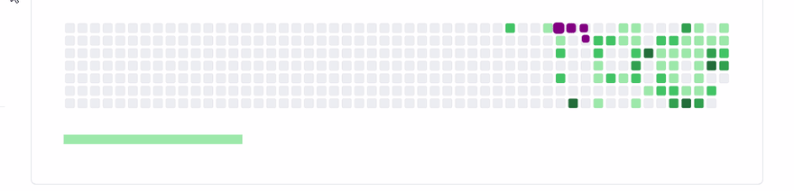

 

<h3>Coding 4 Hobby!  Coding 4 fun! </h3>

<h1 align="center">WELCOME TO MY GITHUB "Sirs" </h1>

- EduardoCaria@, Brazilian, 35 years "young".  

- Private Security Officer. Surveillance Room Operator.  

- Studied HTML&CSS Web Developing because I love it.  

- Cognition in Design-Thinking methods, Devops&Agile and UX basis.  

- Love sport running, the mind just works 100% when well trained.  

- MARKUP

 

IF YOU WANNA CONTACT ME OR KNOW MORE ABOUT ME, CLICK BADGES BELOW:

 

-  Keep Walking Folks!  

<h2 align="center">My Git Stats</H2>

<!---
EduardoCaria/EduardoCaria is a ✨ special ✨ repository because its `README.md` (this file) appears on my GitHub profile.
You can click the Preview link to take a look at my -readme-stats. ALWAYS LOVE GOD)
